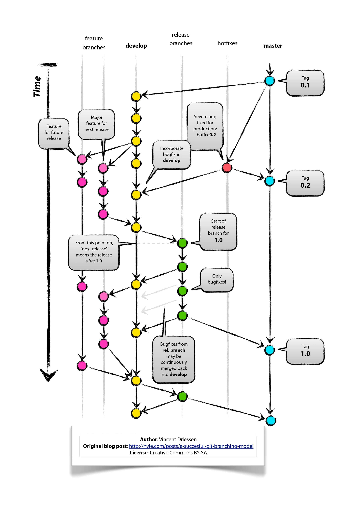
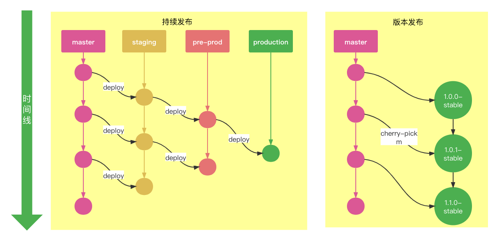
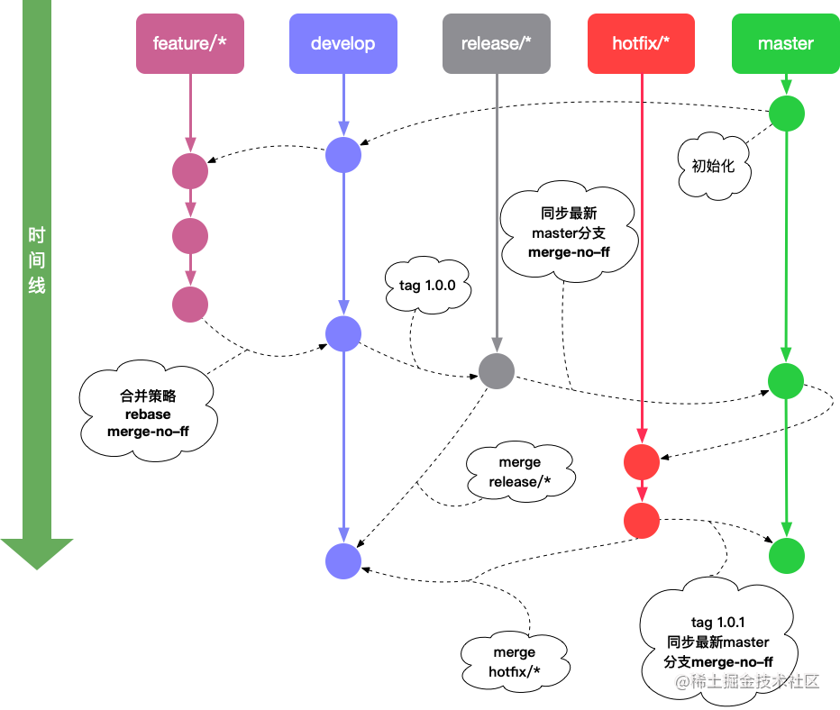
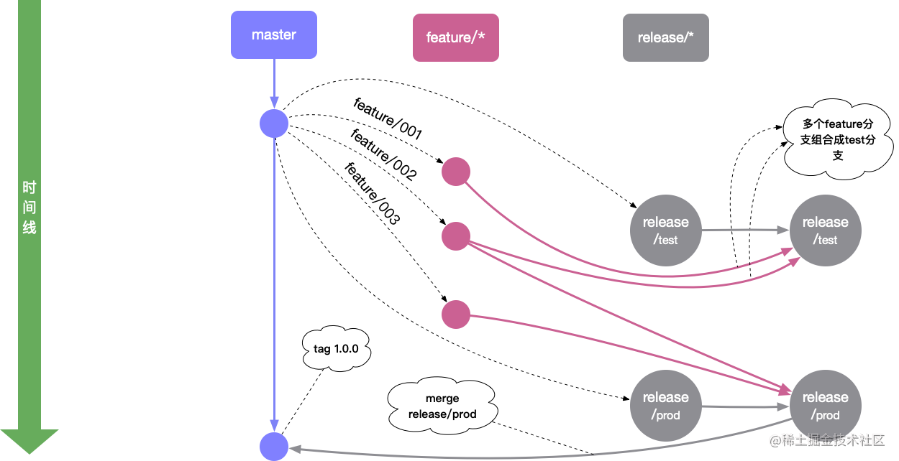

## 概述
在软件研发的过程中，代码分支管理模型至关重要，直接影响着软件研发交付的效率。行业里存在着多各不同的分支管理模型，如GitFlow、GitHubFlow、GitLabFlow、OneFlow以及AOneFlow(阿里)。
各模型存在不同的优缺点，需要根据研发团队的实际情况进行选择（甚至对分支模型进行适当的变种，以适应团队实际的需求）。以下针对几个常见的模型进行介绍。

## 分支模型介绍
### GitFlow
GitFlow是最早诞生并得到广泛应用的一种工作流程。
该模型中存在两种长期分支：master和develop。master中存放对外发布的版本，只有稳定的发布版本才会合并到master中。develop用于日常开发，存放最新的开发版本。
同时还存在三种临时分支：feature, hotfix, release:
+ feature分支是为了开发某个特定功能，从develop分支中切出，开发完成后合并到develop分支中
+ hotfix分支是修复发布后发现的Bug的分支，从master分支中切出，修补完成后再合并到master和develop分支
+ release分支指发布稳定版本前使用的预发布分支，从develop分支中切出，预发布完成后，合并到develop和master分支中

整体分支模型，如下图所示：

优点：
+ feature 分支使开发代码隔离，可以独立的完成开发、构建、测试
+ feature 分支开发周期长于release时，可避免未完成的feature进入生产环境

缺点：
+ 无法支持持续发布
+ 过于复杂的分支管理，加重了开发者的负担，使开发者不能专注开发
### GitHubFlow
GitHubFlow分支模型只存在一个master主分支，日常开发都合并至master，永远保持其为最新的代码且随时可发布的。在需要添加或修改代码时，基于master创建分支，提交修改。
创建Pull Request，所有人讨论和审查你的代码。然后部署到生产环境中进行验证。待验证通过后合并到master分支中。

整体分支模型，如下图所示：

优点：
轻便快捷、简洁易理解，将master作为核心的分支，代码更新持续集成至master上

缺点：
多版本并行的产品线不适用
### GitLabFlow
GitLabFlow是GitFlow和GitHubFlow的结合体，吸取了两者的优点：既有适应不同开发环境的弹性，又有单一主分支的简单和便利。
该模型采取上游优先的原则，即只存在一个master主分支，它是所有分支的上游。只有上游分支采纳的变动才能应用到其他分支。对于持续发布的项目，建议在master之外再建立对应的环境分支，如预生产环境pre-production，生产环境production。对于版本发布的项目，建议基于master创建稳定版本对应的分支，如stable-1，stable-2。

整体分支模型，如下图所示：

优点：
git提交历史更加清晰、简洁与易读

缺点：
对开发人员的能力提出了更高的要求，当存在多产品线时，分支管理比较复杂
### OneFlow
Adam Ruka 于2017年提出，可以简单的理解为 Git Flow 的简化版本，除了 develop 开发分支和最新发布 master 分支，其余皆是临时分支，一旦开发完成即可删除临时分支。

整体分支模型，如下图所示：

优点：
单一版本首选，git 提交历史简介清晰易读

缺点：
不适合持续交付或持续部署的项目，也不适用多版本共存的项目
### AOneflow
由阿里巴巴技术专家林帆提出的一种改进模型，其主要分为三种分支类型：主干分支、特性分支以及发布分支，并且提出了三个基本准则：
+ 主干创建特性分支，且不允许合并回主干分支
+ 合并特性分支，形成发布分支
+ 发布到线上正式环境后，合并相应的发布分支到主干，在主干添加标签，同时删除该发布分支关联的特性分支

整体分支模型，如下图所示：

优点：
灵活易用，通过组合生成分支往往可以实现多种高级玩法

缺点：
复杂度稍高，如果没有配套的工具规范往往会出现“无效分支”的出现
## 分支命名规约
| 前缀 |	含义 | 
| ---- | ---- |
| **-test	| 测试分支，验证后可直接发布的版本 |
| **-beta	| 用于发布beta版本分支 |
| **-release	| 用于发布正式稳定版分支 |
| develop	| 开发主分支，最新的代码分支 |
| feature-**	| 功能开发分支 |
| bugfix-**	| 未发布bug修复分支 |
| hotfix-**	| 已发布bug修复分支 |
## 提交命名规约
除了分支的名称需要规范，提交的命名也同样如此，格式为：[操作类型]操作对象名称，如[ADD]readme，代表增加了readme描述文件。

常见的操作类型有：
+ [IMP] 提升改善正在开发或者已经实现的功能
+ [FIX] 修正BUG
+ [REF] 重构一个功能，对功能重写
+ [ADD] 添加实现新功能
+ [REM] 删除不需要的文件

## 参考文章
+ [《一图看懂各种分支管理模型》](https://www.imooc.com/article/322747)
+ [《汉得Hzero开放平台》](https://open.hand-china.com/document-center/doc/product/10067/10239?doc_id=34366&doc_code=6160)
