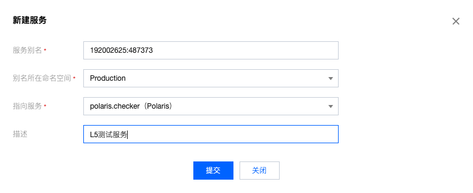

## 环境准备

### 部署polaris

如果已经部署好了polaris，可忽略这一步。

polaris支持在kubernetes环境中进行部署，注意必须保证暴露HTTP端口为8090，gRPC端口为8091。具体部署方案请参考：

- [单机版部署指南](/docs/使用指南/服务端安装/单机版安装/)
- [集群版部署指南](/docs/使用指南/服务端安装/集群版安装/)


### 开启服务端的 L5 接入能力

编辑 polaris-server.yaml 配置文件

```yaml
# apiserver配置
apiservers:
  ...
  # - name: service-l5
  #   option:
  #     listenIP: 0.0.0.0
  #     listenPort: 7779
  #     clusterName: cl5.discover
```

将相关注释移除

```yaml
# apiserver配置
apiservers:
  ...
  - name: service-l5
    option:
      listenIP: 0.0.0.0
      listenPort: 7779
      clusterName: cl5.discover
```

### 重启 polaris-server


{}
```shell
bash tool/stop.sh
bash tool/start.sh
```
{}
{}
```shell
bash tool/stop.cmd
bash tool/start.cmd
```
{}



## 修改 L5Agent 配置

修改 L5Agent 安装目录下的 `conf/l5_config.ini` 配置文件

```conf
[L5CONFIG]
ServerIp={北极星服务端IP}
ServerPort=7779
```

修改完上述配置之后，重启 L5Agent。在重启前需要删除 **/data/L5Backup/l5server_list.backup**

## 验证

### SID 规范以及注意

- L5 SDI 的格式：ModID:CmdID
- 强烈建议用户命名空间选择 default 或者 Production，ModID 取值范围为： [2, 192,000,000]
- 如果用户确实有需要使用其他命名空间，请按照以下方式进行其他命名空间的换算：ModID 数值右移6位，如果结果 >= 3000001，则需要计算 ModID & 63 的结果值，根据结果值对应的命名空间信息如下，否则会出现L5寻址失败的问题：
  ```json
  {
      1: "Production",
      2: "Development",
      3: "Pre-release",
      4: "Test",
      5: "Polaris",
      6: "default",
  }
  ```

### 创建测试服务以及SID

由于 l5api 仅支持访问 L5 SID，因此访问非 L5 SID 格式的服务名，需要创建 CL5 SID 格式的服务别名指向该服务



### 执行

```bash
➜  bin ./L5GetRoute1 192002625 487373 3 
ip is :127.0.0.1 port is : 8091, usec=153,avg_usec=153=========================
ip is :127.0.0.1 port is : 8091, usec=2,avg_usec=77=========================
ip is :127.0.0.1 port is : 8091, usec=111,avg_usec=88=========================
```
